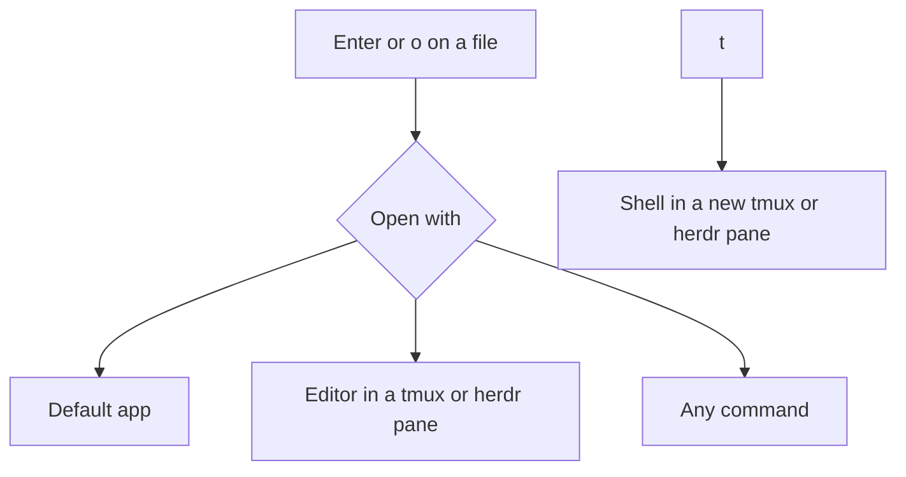
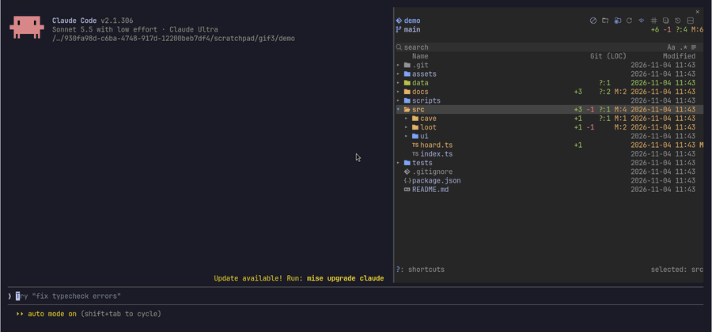

# Open files

```mermaid
flowchart TB
  A[Enter or o on a file] --> B{Open with}
  B --> C[Default app]
  B --> D[Editor in a tmux or herdr pane]
  B --> E[Any command]
  F[t] --> G[Shell in a new tmux or herdr pane]
```

- Open files in their default app, an editor in a tmux or herdr pane, or any command, and `t` opens a shell in a folder in a new tmux or herdr pane (where Terminal target says)

